```{r setup, include=FALSE}
library(emo)
library(icons)
options(htmltools.dir.version = FALSE)
knitr::opts_chunk$set(echo = FALSE, fig.align = "center")
```

```{r, eval = FALSE, inclue = FALSE}
remotes::install_github("mitchelloharawild/icons")
icons::download_fontawesome()
remotes::install_github("hadley/emo")
```


exclude: true

class: inverse, center, middle

# Introduction

---
exclude: true

# Science Reproductible avec un grand R

**Résumé :** Le logiciel R est un outil indispensable aux recherches menés au sein d'AMURE.
Dans le contexte du mouvement de la science ouverte, Qu'il s'agisse d'analyse de données, de statistique ou de modélisation,  se pose la question de la reproductibilité de la science  : sommes nous tous capables de réutiliser les outils développés il y a 6 mois, un an ou plus ? Ces outils sont-ils suffisament ouverts pour permettre une utilisation par tout à chacun ? Enfin, à quoi peuvent bien servir des données ouvertes si les outils qui les utilisent ne le sont pas ?
Cette présentation fera un tour d'horizon des bonnes pratiques sous R et des outils qu'il propose afin de faciliter une production quotidienne de science reproductible et ouverte. Au programme : Rstudio, packages, Git/Github, données, documentation.

---
exclude: false

# Objectif : bonnes pratiques en R

Background : Apprentissage de R pour l'écologie, traitements de données.

R est construit par et pour des statisticiens mais possède une grande communauté
qui partage de plus en plus de "bonne pratiques". Plus proche du software engineering.

On ne va pas parler de stats aujourd'hui.


**photo de moi sur le terrain**


---

# Reproductibilité ?

.pull-left[
Pouvoir reproduire une analyse, une figure ou des données efficacement !

##Principe FAIR :

.pull-left[
- **F**indable
- **A**ccessible 
]

.pull-right[
- **I**nteroperable
- **R**eusable
]
]

--

.pull-right[
```{r, out.width="65%"}
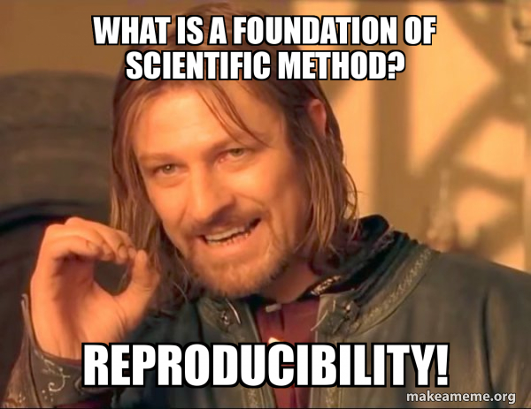
```
]

--

```{r, out.width="90%"}
knitr::include_graphics("CSU_RepRo_files/figure-html/repro-spectrum.jpg")
```

.footnote[
Figure : [Peng. "Reproducible Research in Computational Science". In: *Science* (2011).](https://www.science.org/doi/10.1126/science.1213847)
]

---

# Findable &#x1F50D;

**Un donnée ou une figure non liées au code qui l'a produit n'est pas reproductible.**

L'emplacement du code doit être explicite. Le trouver ne doit pas être une aventure.

.pull-left[
Cela passe par quelques conseils :

- Noms de scripts explicites. <br/> (on évite les noms comme **test**, **test2**)

- Structure de dossier, **Compendium**

- Disque réseau et/ou en ligne

- Dossier avec noms de **projets** <br/> (sans espaces et accents !)

<!-- ? expliciter la location du code dans les rapports etc. toujour lier les données aux scripts qui les ont fait. (localité, sources etc) -->
]

.pull-right[
```{r, out.width="90%"}
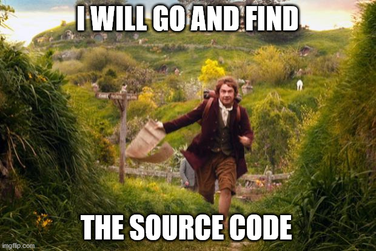
```

- Logiciel de version control (**git**)
]

```{r, echo=TRUE}
list.files()[1:4]
```


???

Pour le coup les infos ici vont enormement avec accessible et donc je préciserais ce qu'est un compendium à ce moment.
La diapo suivante parle de git


---

# Pourquoi utiliser un CVS ?

Est-ce que vous avez déjà :

- **Fait un changement de code et voulu revenir en arrière ?**
- **Perdu du code ou une sauvegarde trop ancienne ?**
- Voulu voir la difference entre 2 versions ?
- Voulu vérifier l'historique d'un script ?
- **Voulu travailler sur un script a plusieurs ?**
- **Voulu partager votre code à quelqu'un ?**
- Voulu tester une nouveauté sans modifier du code déjà utile ?

Si oui, et dans plein de cas, un système de version control aurait pu vous simplifier la vie.

---
background-image: url(./CSU_RepRo_files/figure-html/phd101212s.png)
background-size: contain

# Pourquoi utiliser un CVS ?


---
layout: true

# Git : comment ça marche ?

---

## 3 commandes à retenir : commit, push, and pull

- pull: met a jour le projet local avec la dernière version du projet<sup>*</sup>

- commit: enregistre une snapshot du code à un certain point temporel. 
<br/>(permet d'associer du texte pour expliquer les modifications)

- push: met en commun les modifications locales avec le projet principal<sup>*</sup>


```{r, out.width="60%"}
knitr::include_graphics("CSU_RepRo_files/figure-html/git_tab.png")
```


.footnote[
[*] Si herbergé en ligne.
]
---

```{r, out.width="85%"}
knitr::include_graphics("CSU_RepRo_files/figure-html/commit_mess.png")
```

.footnote[
xkcd comics, [CC BY-NC 2.5 license](https://xkcd.com/license.html)
]
---

## Sauvegarder en ligne ?

```{r, out.width="85%"}
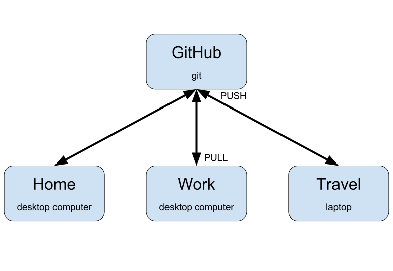
```

---

```{r, out.width="100%"}
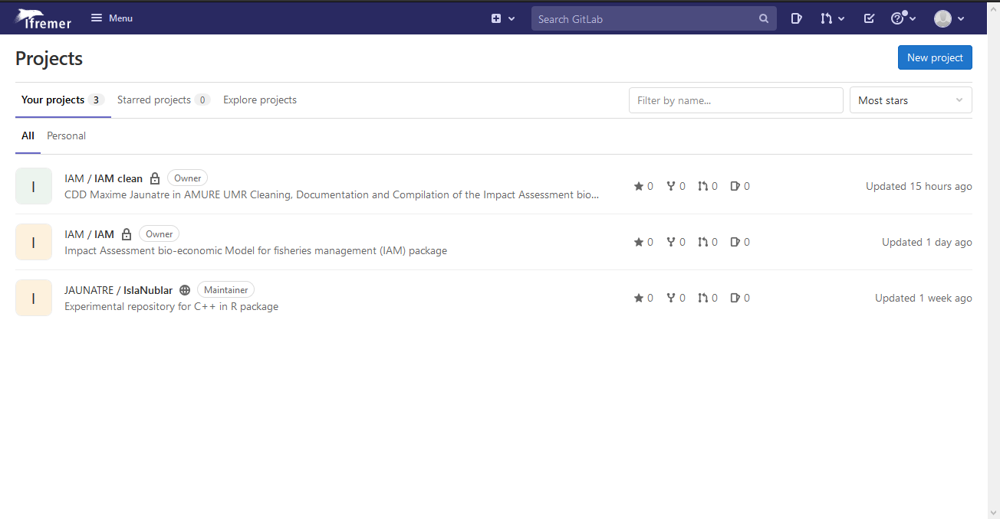
```

**Connection avec login extranet**, possibilité de partager à des membres externes.

---

```{r, out.width="100%"}
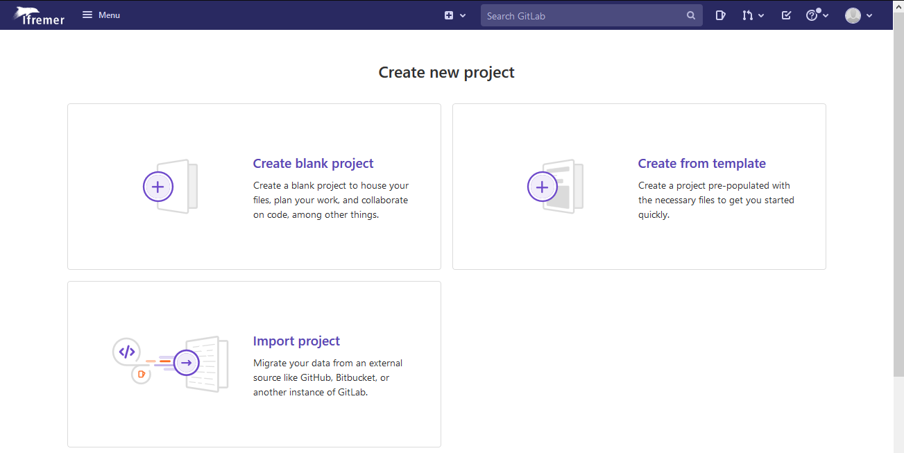
```

---


```{r, out.width="100%"}
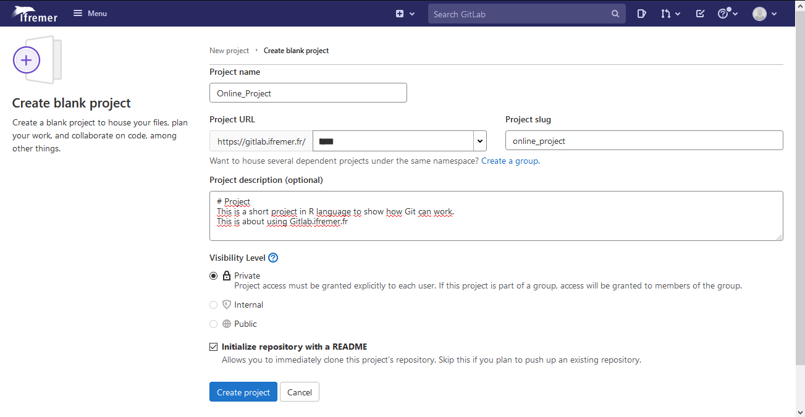
```

---
layout: false

# Ressources Git

.pull-left[

- [Tutoriel ThinkR : R and Git](https://thinkr.fr/travailler-avec-git-via-rstudio-et-versionner-son-code/)

- [Advance R &#x1F4D4;, H. Wickham](http://r-pkgs.had.co.nz/git.html)

- [Happy Git and GitHub for the useR](http://happygitwithr.com/)

- [Git cheatsheet](https://services.github.com/on-demand/downloads/github-git-cheat-sheet.pdf)

- [Quand ça part en vrille](https://github.com/k88hudson/git-flight-rules)

- [Réparer une erreur](http://ohshitgit.com/)

- [Créer une nouvelle branche avec git et merge des branches](https://github.com/Kunena/Kunena-Forum/wiki/Create-a-new-branch-with-git-and-manage-branches)
]

.pull-right[
```{r, out.width="90%"}
knitr::include_graphics("CSU_RepRo_files/figure-html/git.png")
```
]

.footnote[
xkcd comics, [CC BY-NC 2.5 license](https://xkcd.com/license.html)
]
---
layout: true

# Accessible &#x1F4C2;

---

## COMPENDIUM &#x1F4E6;

.pull-left[
Structurer les dossiers en packages R.

```{r, out.width="65%"}
  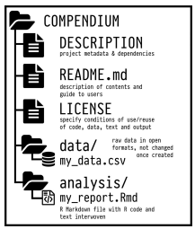
```

[Marwick et al. "Packaging Data Analytical Work Reproducibly Using R (and Friends)". In: *The American Statistician* (2017).](https://peerj.com/preprints/3192/)
]

.pull-right[
```{r, out.width="65%"}
  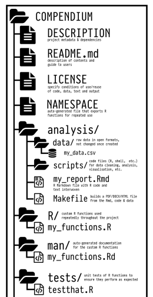
```
]

---

.pull-left[
- **`README`** : entrée classique de documentation.

- Aide à l'installation et l'utilisation

- Pour ajouter à un projet : `usethis::use_readme_md()`

```{r, out.width="90%"}
  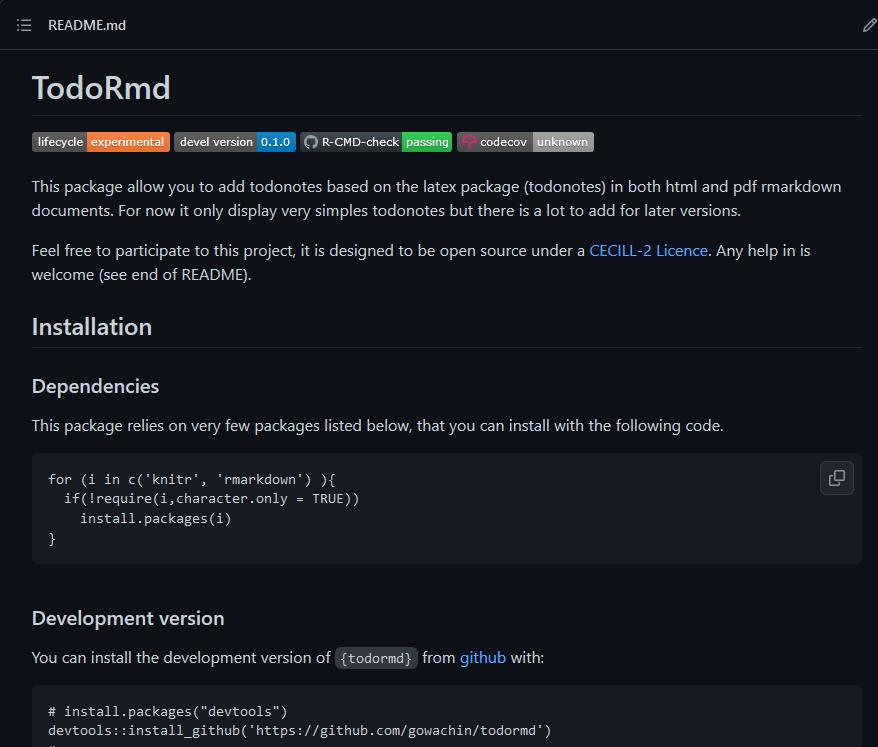
```
]

--

.pull-right[
- **`LICENCE`** : sans licence, un code est théoriquement inutilisable. <br/>(**MIT**, **GNU GPL**, **CC**)

Dicte les droits d'utilisation, de copie, de modification d'un code.

[Loi Numérique n°2016-1321](https://www.legifrance.gouv.fr/loda/article_lc/LEGIARTI000033205142/2020-09-21/) impose une licence libre pour tout logiciel produit avec des fonds publics.

```{r, out.width="70%"}
  
```

A nuancer avec les questions de publications, de tutelles etc.
]

---

## Projet = Package &#x1F4E6;

.pull-left[
- **`DESCRIPTION`** : 

```
Package: todormd
Type: Package
Title: Using todonotes in rmarkdown package
Version: 0.1.0
Authors@R: c(
    person('Maxime', 'Jaunatre', 
    email = "maxime.jaunatre@yahoo.fr", 
    role = c('aut', 'cre'))
    )
Description: Personnal project number x
License: CeCILL-2
Encoding: UTF-8
Imports:
    knitr, 
    rmarkdown
RoxygenNote: 7.1.1
Suggests: 
    testthat (>= 3.0.0)
```


]

.pull-right[
- **`NEWS.md`** : Fichier de suivis des mises à jour d'un projet.

Permet d'informer sur un changement majeur ou des nouveautés. Important d'avoir un cycle de version avec :<br/> `0.1.1` > `0.1.0`

[Why and how maintain a NEWS file for your R package?](https://blog.r-hub.io/2020/05/08/pkg-news/)

<br/>

- Pour ajouter une dépendances au projet : `devtools::use_package("tidyr")`
]

---

## Documentation &#x2139;

.pull-left[

- Rédiger en amont (`{Roxygen2}`)

```{r, echo = TRUE}
#' half_life
#' 
#' compute half_life percentage.
#' 
#' @param period period in minute
#' @param time time elapsed (min)
#'
#' @return percentage.
#' @author M. Jaunatre <mail>
#' 
#' @examples
#' half_life(20, 20)
#' half_life(20, 40)
#' 
half_life <- function(period, time){
  return((1 - 2^(-time/period)) * 100)
}
```
]

.pull-right[
```{r, out.width="100%"}
  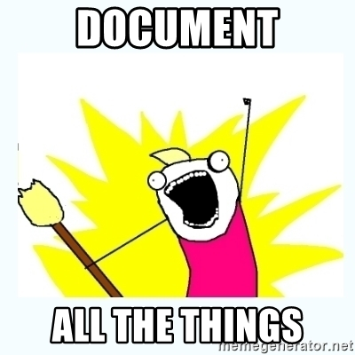
```
]

---

## Documentation &#x2139;

.pull-left[

**Forme longue de documentation**

- `{Rmarkdown}` ! Permet de mélanger texte (**md**, $\LaTeX$) et code **R**.

- Vignettes pour les packages

- Rédaction d'articles -> `{rticles}`

- Diapos -> `{xaringan}`

- Livre -> `{bookdown}`

- Site web -> `{pkgdown}`


```{r, out.width="15%", fig.show='hold', align.center = TRUE, fig.cap="   "}
knitr::include_graphics(c(
  "CSU_RepRo_files/figure-html/rmarkdown.png", 
  "CSU_RepRo_files/figure-html/knitr.png", 
  "CSU_RepRo_files/figure-html/rticles.png", 
  "CSU_RepRo_files/figure-html/xaringan.png", 
  "CSU_RepRo_files/figure-html/bookdown.png", 
  "CSU_RepRo_files/figure-html/pkgdown.png"))
```
]

.pull-right[
```{r, out.width="100%"}
  knitr::include_graphics("CSU_RepRo_files/figure-html/markdown.png")
```
]

---

## Lisibilité

.pull-left[
```{r, echo = TRUE, eval = FALSE}
# Title ####
# Author, date, contact etc
# Description

## Depends ####
library(IAM)
# devtools::install_github(
#   "github.com/gowachin/todormd"
# )

# sources 
sources("R/hello_world.R")
# functions
foo <- function(){cat("Don't panic !")}

## Datasets ####
read.csv(file = "raw_data/sole.csv")

## Edit Dataset ####

## Plots ####
## Export ####
```
]

.pull-right[
- **DRY** (Don't Repeat Yourself)

- **KISS** (Keep it Simple, Stupid) <br> plein de petits fichiers > script infini

- `{cleanR}`: nettoyer les lignes inutiles.

- `{styleR}`: reformate le code.

```{r, out.width="100%"}
  knitr::include_graphics("CSU_RepRo_files/figure-html/unreadible.png")
```
]

---

## Lisibilité

.pull-left[
```{r, echo = TRUE, eval = FALSE}
#                 Bad                 #
if(`T`){print(10)}
 `T` <- FALSE
 `mean` <- function(x) sum(x)

if (y < 0 && debug) 
*  message("y is negative")
*  stop("error for in y test")


*function_with_many_argument("that", many)

function_with_many_argument(x = "that", 
*  many) 


x` = `5
i = 0` ; y=12`
```
]

.pull-right[
```{r, echo = TRUE, eval = FALSE}
#                 Nice                #
if(TRUE){print(10)} # Full logical
testing <- FALSE # name conflict
use_sum <- function(x) sum(x)

if (y < 0 && debug) {
  message("y is negative")
  stop("error for in y test")
} # Braces

function_with_many_argument(
  x = "that",
  y = many # name args
) # line limit = 80

x <- 5 # arrow
i <- 0
y <-12
```
]

"**Code needs a lot of whitspace. That is how it breathes.**" Roger Peng

---
layout: true
# Interopérable &#x1F4CE;

---

**Un projet ne doit pas dépendre de l'ordinateur qu'il utilise** -> Portabilité

Cela signifie l'oublis de ces commandes maudites : 

```{r, echo=TRUE, eval = FALSE}
*setwd("C:/home/maxime/Documents/Projet magnifique/mouette/analyse/bob/modèle/test/")
```


```{r, echo=TRUE, eval=FALSE}
rm(list = ls()) # -> Supprime uniquement les objects "utilisateurs"
                # -> Ne supprime pas des dépendances chargées.
                # -> Indique une sesssion R ouverte depuis 30 ans
                # -> Vide l'environnement des copains qui veulent aider
                # -> Participe à la disparition des bébés phoques
```

Si votre script possède ces lignes, **Jenny Bryan viendra bruler** votre ordinateur. &#x1F525;

Solution ? Utiliser les **Projets Rstudio**

.footnote[
*A noter l'espace, et l'accent dans ce chemin !*
]

---

`File -> New Project -> New Directory`

```{r, out.width="70%"}
  knitr::include_graphics("CSU_RepRo_files/figure-html/new_project.png")
```

---

Dans un project, tout les chemins sont basés sur la racine du projet (où ce situe `.Rproj`)

```{r, out.width="70%"}
  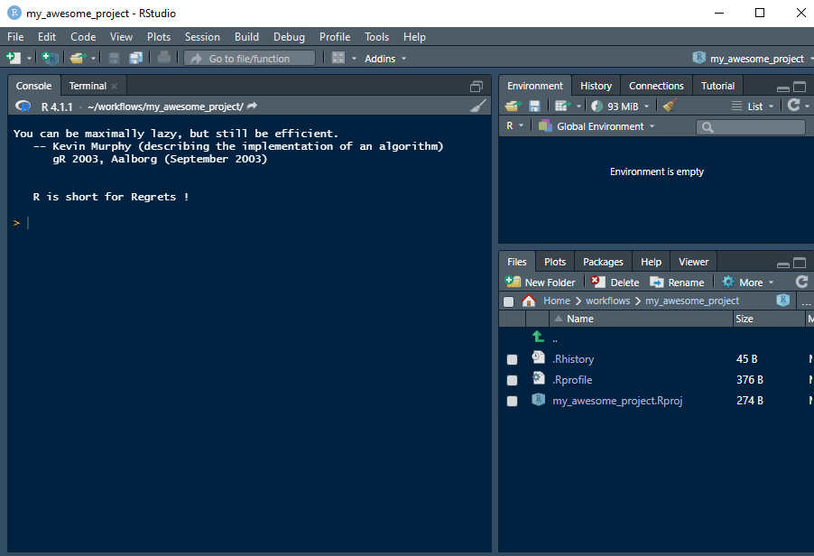
```

Désactiver la sauvegarde automatique !

`Tools -> Global options -> General -> un-tick "always save history"`

---
layout: true

# Reusable &#x1F503;

---

## Données

**Un script ne doit dépendre que des données présentes dans son projet.**

- Eviter les `.RData` ! Ce format de fichier montre que vos données sont trop complexes et que le script qui les produit n'est pas clair.

Seule exception : les données de type cache : permet de faire tourner les scripts plus facilement. Mais encore une fois des outils existent pour éviter cela comme `{drake}`, qui permet de refaire tourner que les parties modifiées ou dépendantes d'un script.

```{r, out.width="70%"}
  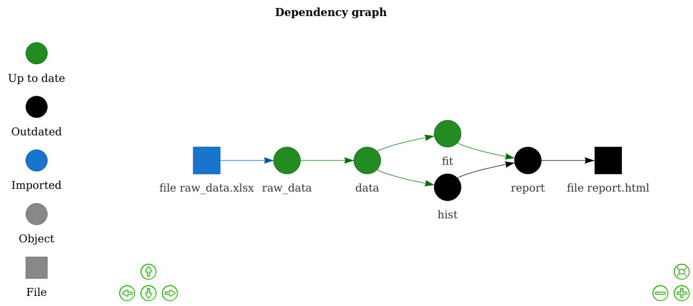
```

---

Parfois les données sont complexes et non distribuables. Dans ce cas, prévoir le minimum pour montrer que le code marche.

- Avoir un **exemple** simplifié pour chaque script.

Exemple : ici la fonction prend un object en entrée...mais quel format doit-il avoir ?

.pull-left[
```{r, echo = TRUE}
rm_dups <- function(data){
  data <- data[! duplicated(data$x), ]
  data
}
```
]

.pull-right[
```{r, echo = TRUE}
df <- data.frame(x = c(0,1,1,0), 
                 y = c(2,1,0,0))
rm_dups(df)
```
]

Fournir un exemple est un très bon début de documentation.

Exemple = niveau 0 du test !

---

## Test !

Nous testons tous nos codes à la main, et ça marche sur le coup...mais 2 semaines après ?


.pull-left[

- Ecrire des tests unitaires qui font tourner le code tout seul. <br/> -> Dossier `test/`

- `usethis::use_testthat()` charge automatiquement `{testthat}`

```{r, out.width="20%"}
  knitr::include_graphics("CSU_RepRo_files/figure-html/testthat_logo.png")
```
]

.pull-right[
```{r, out.width="70%"}
  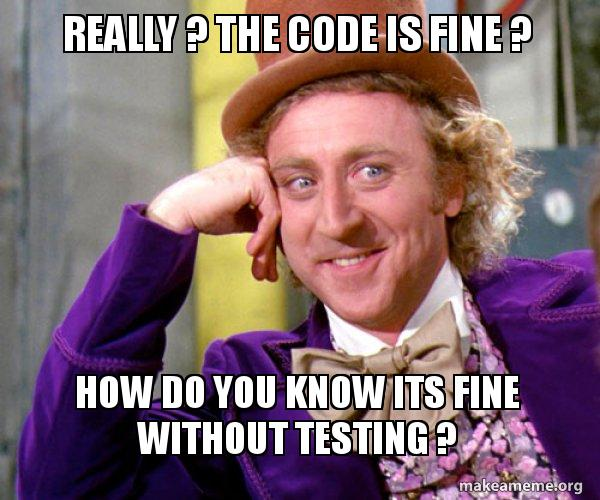
```
]

**Il vaut mieux prévenir que guérir !**

---

## Test !

.pull-left[

Utiliser `{usethis}` pour simplifier la vie !

- `usethis::use_test("add")`

```{r, echo = TRUE, eval = FALSE}
tests
├── testthat
│   └── test-add.R
└── testthat.R
```

Rédiger des tests n'est jamais agréable mais sauve du temps plus tard.

**Retour rapide** lors de la modification du code + assurance de rien casser.
]

.pull-right[
```{r, echo = TRUE}
library(testthat)
add <- function(y,x){
  x+y
}

test_that("add works", {
  expect_equal(add(39, 3), 42)
})
```

```{r, out.width="70%"}
  
```
]


---
layout: false

# Trouver de l'aide pour R &#x1F64F;

.pull-left[
## RTFM<sup>*</sup>
- utiliser les aides `help(sum)` ou `?sum`
- lire les **manuels** de packages [ggplot2](https://ggplot2.tidyverse.org/)
- avoir les **cheatsheet** quelque part !

## [Stack overflow `r icons::fontawesome("stack-overflow")`](https://stackoverflow.com/questions/tagged/r)
## Issue Github `r icons::fontawesome("github")`
]
.pull-right[
## Livres et blogs
- [Advance R, Hadley Wickham](http://r-pkgs.had.co.nz/git.html)
- [Git et Rstudio, ThinkR](https://thinkr.fr/travailler-avec-git-via-rstudio-et-versionner-son-code/)
- [Project-oriented workflow, Jenny Bryan](https://www.tidyverse.org/blog/2017/12/workflow-vs-script/)

## Conférences
- [Code smells and feels, Jenny Bryan](https://youtu.be/7oyiPBjLAWY)
- Toutes les conférences UseRs `r icons::fontawesome("youtube")`
]

## Communauté francophone de R : 
.pull-left[
- [frrrenchies](https://github.com/frrrenchies/frrrenchies) : list de doc fr
]
.pull-right[
- [slack grrr](https://join.slack.com/t/r-grrr/shared_invite/zt-46utbgb9-uvo_bg5cbuxOV~H10YUX8w) : question, news, jobs...
]

.footnote[
[*] Read The Fucking Manual.
]

---

class: inverse, center, middle

# Merci! Des questions &#x2753;

[https://gowachin.github.io/R_presentation/CSU_RepRo.html](https://tinyurl.com/ycktp4kv)

`r icons::fontawesome("github")` [Gowachin](https://github.com/gowachin) &nbsp;&nbsp;&nbsp;&nbsp; `r icons::fontawesome("stack-overflow")` [Gowachin](https://stackoverflow.com/users/12501379/gowachin)

.footnote[
Slides created via the R package [**xaringan**](https://github.com/yihui/xaringan).
]
