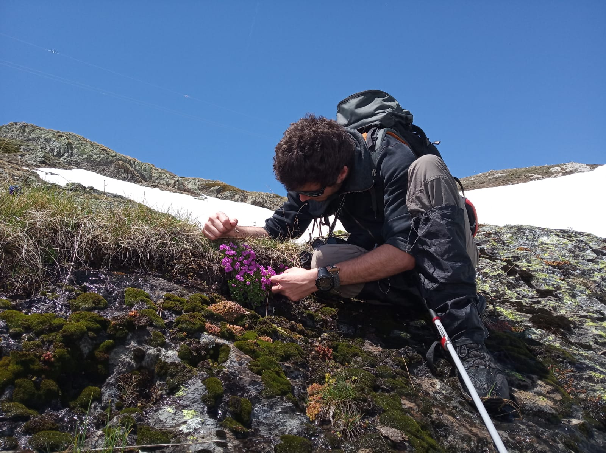
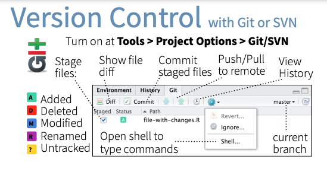
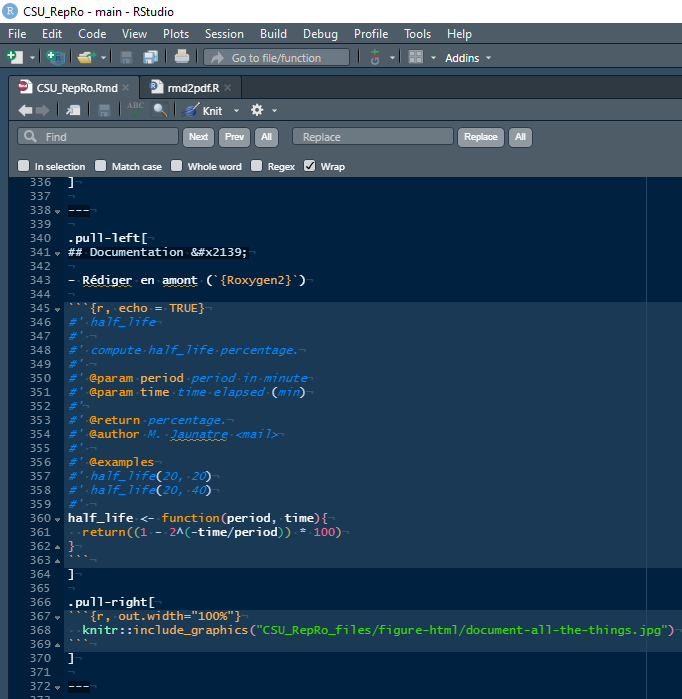
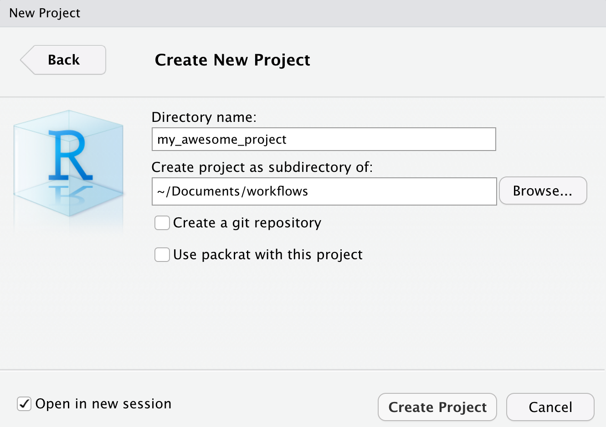

```{r setup, include=FALSE}
library(emo)
library(icons)
options(htmltools.dir.version = FALSE)
knitr::opts_chunk$set(echo = FALSE, fig.align = "center")
```

```{r, eval = FALSE, inclue = FALSE}
# This are the dependencies to compile this rmd.
remotes::install_github("mitchelloharawild/icons")
icons::download_fontawesome()
remotes::install_github("hadley/emo")
```


exclude: true

class: inverse, center, middle

# Introduction

---
exclude: true

# Science Reproductible avec un grand R

**Résumé :** Le logiciel R est un outil indispensable aux recherches menés au sein d'AMURE.
Dans le contexte du mouvement de la science ouverte, Qu'il s'agisse d'analyse de données, de statistique ou de modélisation,  se pose la question de la reproductibilité de la science  : sommes nous tous capables de réutiliser les outils développés il y a 6 mois, un an ou plus ? Ces outils sont-ils suffisament ouverts pour permettre une utilisation par tout à chacun ? Enfin, à quoi peuvent bien servir des données ouvertes si les outils qui les utilisent ne le sont pas ?
Cette présentation fera un tour d'horizon des bonnes pratiques sous R et des outils qu'il propose afin de faciliter une production quotidienne de science reproductible et ouverte. Au programme : Rstudio, packages, Git/Github, données, documentation.

---
exclude: false

# Objectif : bonnes pratiques en R

## `r icons::fontawesome("r-project")` : Construit par et pour des statisticiens.

- Majorité d'utilisateurs non informaticiens. 

- Bonne pratiques de *software engineering* diffusent dans la communauté.

???

Peu d'utilisateurs sont des informaticiens et n'ont pas les réflexes 
de développement logiciel.
L'apprentissage se fait par la communauté et toutes les ressources disponibles 
(présentations, blogs, livres).

--

.pull-left[
Formation personnelle : Apprentissage de R pour l'**écologie**, traitements de données.

Bonnes pratiques viennent des échanges, de la communauté et de la pratique.
]

.pull-right[
```{r, out.width="100%"}

```
]

???

Exemple : mon parcours de biologie ne m'a pas donnée les bases d'informatique
par rapport a mon expérience de terrain en écologie.
Beaucoup de formation indépendante en autonomie.
Importance de travailler sur de petits projets persos et de se tenir au courant
des nouveautés de la communauté. S'impliquer.

Je vais aussi présenter plein de choses que j'ai apprises, ou qui existents.
L'important n'est pas de tout tester d'un coup mais d'incorporer aux méthodes 
de travail au fur et a mesure.

--

.footnote[
On ne va pas parler de statistiques aujourd'hui.
]

???

Et les diapos contiennent le minimum de code.

---

# Reproductibilité ?

.pull-left[
Pouvoir reproduire une analyse, une figure ou des données efficacement !

##Principe FAIR :

.pull-left[
- **F**indable
- **A**ccessible 
]

.pull-right[
- **I**nteroperable
- **R**eusable
]
]

???

Le principe FAIR a été expliqué auparavant pour l'ouverture des données
mais de nombreux parallèles peuvent être utilisés pour le code source.

La présentation va suivre l'ordre FAIR et partir du niveau dossier vers 
une organisation en fichiers.

--

.pull-right[
```{r, out.width="65%"}

```
]

--

```{r, out.width="90%"}
knitr::include_graphics("CSU_RepRo_files/figure-html/repro-spectrum.jpg")
```

.footnote[
Figure : [Peng. "Reproducible Research in Computational Science". In: *Science* (2011).](https://www.science.org/doi/10.1126/science.1213847)
]

???

Encore une fois, chaque projet se place sur ce spectre et peut s'améliorer par 
de petits ajouts. Pas besoin d'utiliser toute ce qui est présenté.
Le mieux est d'inserer ces bonnes pratiques dès le début des projets.


---

# Findable &#x1F50D;

**Un donnée ou une figure non liées au code qui l'a produit n'est pas reproductible.**

L'emplacement du code doit être explicite. Le trouver ne doit pas être une aventure.

.pull-left[
Cela passe par quelques conseils :

- Noms de scripts explicites. <br/> (on évite les noms comme **test**, **test2**)

- Structure de dossier, **Compendium**

- Disque réseau et/ou en ligne

- Dossier avec noms de **projets** <br/> (sans espaces et accents !)

<!-- ? expliciter la location du code dans les rapports etc. toujour lier les données aux scripts qui les ont fait. (localité, sources etc) -->
]


.pull-right[
```{r, out.width="90%"}

```

- Logiciel de control de version (**git**)
]

```{r, echo=TRUE}
list.files()[1:4]
```


???

Bien nommer et placer ses dossiers est important, il ne faut pas perdre de temps
à chercher ses petits scrips.

Les espaces et les accents sont pénibles quand on partage nos dossiers
avec d'autres gens (norme anglophone) et pour l'utilisation d'outils de recherche
d'information (outils linux, grep et scripts R -> norme ASCII)

L'organisation en compendium est détaillée dans la partie "accessible"
Git est detaillé dans les diapos suivantes.

Trouver "géographiquement" le code mais aussi temporellement avec git.


---
exclude: false

# Pourquoi utiliser un CVS ?

Est-ce que vous avez déjà :

- **Fait un changement de code et voulu revenir en arrière ?**
- **Perdu du code ou une sauvegarde trop ancienne ?**
- Voulu voir la difference entre 2 versions ?
- Voulu vérifier l'historique d'un script ?
- **Voulu travailler sur un script a plusieurs ?**
- **Voulu partager votre code à quelqu'un ?**
- Voulu tester une nouveauté sans modifier du code déjà utile ?

Si oui, et dans plein de cas, un système de version control aurait pu vous simplifier la vie.

???

Diapo dite à l'orale avec le comic suivant.

---
background-image: url(./CSU_RepRo_files/figure-html/phd101212s.png)
background-size: contain

# Pourquoi utiliser un CVS ?

???

Multiplier les versions sur un ordi n'aide pas à retrouver facilement le code

---
layout: true

# Git : comment ça marche ?

---

## 3 commandes à retenir : commit, push, and pull

- commit: enregistre une snapshot du code à un certain point temporel. 
<br/>(permet d'associer du texte pour expliquer les modifications)


```{r, out.width="50%"}

```

???

Installation de git sur l'ordinateur et initialisation de dépots dans un dossier
rejoint la notion de compendium (un projet = un dépot git = un dossier)

commit permet un enregistrement d'une étape temporelle pour les fichiers textes
permet de travailler sur tout fichier texte simple (md, tex, R, code...)

Important de bien nommer ses commits pour se retrouver temporellement

--

- pull: met a jour le projet local avec la dernière version du projet<sup>*</sup>

- push: met en commun les modifications locales avec le projet principal<sup>*</sup>

.footnote[
[*] Si herbergé en ligne.
]

???

Important : git est indépendant de github et peut s'utiliser en solitaire.
pull et push permet de mettre à jour un dépot par rapport à un autre, 
souvent en ligne.

---

```{r, out.width="85%"}
knitr::include_graphics("CSU_RepRo_files/figure-html/commit_mess.png")
```

.footnote[
xkcd comics, [CC BY-NC 2.5 license](https://xkcd.com/license.html)
]

???

commit = doc temporelle, important de pas nommer n'importe comment sinon on s'y 
perd.

---

## Sauvegarder en ligne ?

```{r, out.width="85%"}

```

???

Github est juste un serveur web avec git d'installer dessus et qui peut 
fonctionner comme un drive.

Permet de travailler à plusieurs ordinateurs (une personne) ou du coup à
plusieurs.

Important de commencer seul sur un petit projet pour appréhender le systeme

Github = Microsoft (GAFAM)

---

```{r, out.width="100%"}

```

**Connection avec login extranet**, possibilité de partager à des membres externes.

???

gitlab est une alternative, moins répandue mais plus souveraine.
Ifremer héberge un gitlab et quelques universités également.

quoi qu'il arrive les dépots github/gitlab peuvent être totalement privés.

---

```{r, out.width="100%"}

```

---


```{r, out.width="100%"}

```

???

On peut gérer l'acces aux projets et l'ouvrir au public ou non.
Permet de travailler sur des manuscrits par exemple.

---
layout: false

# Ressources Git

.pull-left[

- [Tutoriel ThinkR : R and Git](https://thinkr.fr/travailler-avec-git-via-rstudio-et-versionner-son-code/)

- [Advance R &#x1F4D4;, H. Wickham](http://r-pkgs.had.co.nz/git.html)

- [Happy Git and GitHub for the useR](http://happygitwithr.com/)

- [Git cheatsheet](https://services.github.com/on-demand/downloads/github-git-cheat-sheet.pdf)

- [Quand ça part en vrille](https://github.com/k88hudson/git-flight-rules)

- [Réparer une erreur](http://ohshitgit.com/)

- [Créer une nouvelle branche avec git et merge des branches](https://github.com/Kunena/Kunena-Forum/wiki/Create-a-new-branch-with-git-and-manage-branches)
]

.pull-right[
```{r, out.width="90%"}
knitr::include_graphics("CSU_RepRo_files/figure-html/git.png")
```
]

.footnote[
xkcd comics, [CC BY-NC 2.5 license](https://xkcd.com/license.html)
]

???

Beaucoup d'information est disponible.
Encore une fois, il vaut mieux commencer sur un petit projet où l'on est à
l'aise.

---
layout: true

# Accessible &#x1F4C2;

---

## COMPENDIUM &#x1F4E6;

.pull-left[
Structurer les dossiers en packages R.

```{r, out.width="65%"}
  
```

[Marwick et al. "Packaging Data Analytical Work Reproducibly Using R (and Friends)". In: *The American Statistician* (2017).](https://peerj.com/preprints/3192/)
]


.pull-right[
```{r, out.width="65%"}
  
```
]

???

Vraiment lire l'article de Marwick 2017.
Le package R est l'exemple typique de code reproductible et distribuable.

A gauche on a l'exemple minimal d'un compendium et à droite la structure la 
plus complete. Cela dépend de quelques fichiers clés que je vais détailler,
mais on peut y rajouter des dossiers comme data, raw_data, test etc.

Organiser nos projets comme des packages permet d'utiliser des outils
de développement et d'avoir accès à des outils reproductibles (test, doc etc.)

---

.pull-left[
- **`README`** : entrée classique de documentation.

- Aide à l'installation et l'utilisation

- Pour ajouter à un projet : `usethis::use_readme_md()`

```{r, out.width="90%"}
  
```
]

???

Générallement le premier fichier à lire quand on ouvre un projet.
Format de présenter du code et du texte pour montrer des exemples.

--

.pull-right[
- **`LICENCE`** : sans licence, un code est théoriquement inutilisable. <br/>(**MIT**, **GNU GPL**, **CC**)

Dicte les droits d'utilisation, de copie, de modification d'un code.

[Loi Numérique n°2016-1321](https://www.legifrance.gouv.fr/loda/article_lc/LEGIARTI000033205142/2020-09-21/) impose une licence libre pour tout logiciel produit avec des fonds publics.

```{r, out.width="70%"}
  
```

A nuancer avec les questions de publications, de tutelles etc.
]

???

Faire le lien avec la notice Licence écrite pour IAM.
Prendre le temps de lire la Licence CeCILL en Fr peut être bénéfique
pour comprendre les enjeux et s'ouvrir à l'open source.

---

## Projet = Package &#x1F4E6;

.pull-left[
- **`DESCRIPTION`** : 

```
Package: todormd
Type: Package
Title: Using todonotes in rmarkdown package
Version: 0.1.0
Authors@R: c(
    person('Maxime', 'Jaunatre', 
    email = "maxime.jaunatre@yahoo.fr", 
    role = c('aut', 'cre'))
    )
Description: Personnal project number x
License: CeCILL-2
Encoding: UTF-8
Imports:
    knitr, 
    rmarkdown
RoxygenNote: 7.1.1
Suggests: 
    testthat (>= 3.0.0)
```

???

Diapo davantage tournée vers la structure de package.

DESCRIPTION est un fichier pensé pour être lue par l'ordi également
ajoute la notion des dépendances d'un package.

--

]

.pull-right[
- **`NEWS.md`** : Fichier de suivis des mises à jour d'un projet.

Permet d'informer sur un changement majeur ou des nouveautés. Important d'avoir un cycle de version avec :<br/> `0.1.1` > `0.1.0`

[Why and how maintain a NEWS file for your R package?](https://blog.r-hub.io/2020/05/08/pkg-news/)

- Pour ajouter une dépendances au projet : `devtools::use_package("tidyr")`

```{r, out.width="15%", fig.show='hold', align.center = TRUE, fig.cap="   "}
knitr::include_graphics(c(
  "CSU_RepRo_files/figure-html/devtools.png"))
```
]

???

NEWS permet d'informer l'utilisateurs des changements entre différentes versions
d'un projet. Bien tenu à jour, il complète git.

---

## Documentation &#x2139;

.pull-left[

- Rédiger en amont (`{Roxygen2}`)

```{r, echo = TRUE}
#' half_life
#' 
#' compute half_life percentage.
#' 
#' @param period period in minute
#' @param time time elapsed (min)
#'
#' @return percentage.
#' @author M. Jaunatre <mail>
#' 
#' @examples
#' half_life(20, 20)
#' half_life(20, 40)
#' 
half_life <- function(period, time){
  return((1 - 2^(-time/period)) * 100)
}
```
]

???

Il vaut mieux documenter en amont comme cela on réfléchis à ce que l'on code.
Permet de clairement identifier ce que l'on prend en entrée et ce que l'on 
retourne.

Permet également d'écrire quelques exemple.

--

.pull-right[
```{r, out.width="100%"}
  knitr::include_graphics("CSU_RepRo_files/figure-html/document-all-the-things.jpg")
```
]

???

La redondance dans la documentation est bénéfique !

---

## Documentation &#x2139;

.pull-left[

**Forme longue de documentation**

- `{Rmarkdown}` ! Permet de mélanger texte (**md**, $\LaTeX$) et code **R**.

- Vignettes pour les packages

- Rédaction d'articles -> `{rticles}`

- Diapos -> `{xaringan}`

- Livre -> `{bookdown}`

- Site web -> `{pkgdown}`


```{r, out.width="15%", fig.show='hold', align.center = TRUE, fig.cap="   "}
knitr::include_graphics(c(
  "CSU_RepRo_files/figure-html/rmarkdown.png", 
  "CSU_RepRo_files/figure-html/knitr.png", 
  "CSU_RepRo_files/figure-html/rticles.png", 
  "CSU_RepRo_files/figure-html/xaringan.png", 
  "CSU_RepRo_files/figure-html/bookdown.png", 
  "CSU_RepRo_files/figure-html/pkgdown.png"))
```
]

.pull-right[
```{r, out.width="100%"}
  
```
]

???

Rmarkdown permet de tout lier et de ne fournir qu'un seul document contentant
l'analyse et la rédaction. Permet de s'assurer que tout tourne,
exemple des scripts stochastiques !
moins de fichiers annexe comme les png et jpeg etc. Juste un fichier et des données

Diapo faites avec Xaringan

rticles est très efficaces pour produire des pdfs au format de soumissions.
Intéressant car cela supprime l'export de figures et assure qu'elles sont
toujours à jour.

---

## Lisibilité

.pull-left[
```{r, echo = TRUE, eval = FALSE}
# Title ####
# Author, date, contact etc
# Description

## Depends ####
library(IAM)
# devtools::install_github(
#   "github.com/gowachin/todormd"
# )

# sources 
sources("R/hello_world.R")
# functions
foo <- function(){cat("Don't panic !")}

## Datasets ####
read.csv(file = "raw_data/sole.csv")

## Edit Dataset ####

## Plots ####
## Export ####
```
]

???

Organisation d'un script présenté ainsi permet au lecteur de 
s'assurer qu'il peut le reproduire
par exemple les librairies au début facilite la vie au lecteur, 
il ne faut plus chercher les dépendances

functions au début permet d'utiliser le principe DRY

--

.pull-right[
- **DRY** (Don't Repeat Yourself)

- **KISS** (Keep it Simple, Stupid) <br> plein de petits fichiers > script infini

- `{cleanR}`: nettoyer les lignes inutiles.

- `{styleR}`: reformate le code.


```{r, out.width="100%"}
  knitr::include_graphics("CSU_RepRo_files/figure-html/unreadible.png")
```
]

???

si beaucoup de fonctions apparaissent -> faire un script externe
si beaucoup de librairie apparaisent -> KISS et nouveau script.


---

## Lisibilité

.pull-left[
```{r, echo = TRUE, eval = FALSE}
#                 Bad                 #
if(`T`){print(10)}
 `T` <- FALSE
 `mean` <- function(x) sum(x)

if (y < 0 && debug) 
*  message("y is negative")
*  stop("error for in y test")


*function_with_many_argument("that", many)

function_with_many_argument(x = "that", 
*  many) 


x` = `5
i = 0` ; y=12`
```
]

.pull-right[
```{r, echo = TRUE, eval = FALSE}
#                 Nice                #
if(TRUE){print(10)} # Full logical
testing <- FALSE # name conflict
use_sum <- function(x) sum(x)

if (y < 0 && debug) {
  message("y is negative")
  stop("error for in y test")
} # Braces

function_with_many_argument(
  x = "that",
  y = many # name args
) # line limit = 80

x <- 5 # arrow
i <- 0
y <-12
```
]

"**Code needs a lot of whitspace. That is how it breathes.**" Roger Peng

---
layout: true
# Interopérable &#x1F4CE;

---

**Un projet ne doit pas dépendre de l'ordinateur qu'il utilise** -> Portabilité

Cela signifie l'oublis de ces commandes maudites : 

```{r, echo=TRUE, eval = FALSE}
*setwd("C:/home/maxime/Documents/Projet magnifique/mouette/analyse/bob/modèle/test/")
```


```{r, echo=TRUE, eval=FALSE}
rm(list = ls()) # -> Supprime uniquement les objects "utilisateurs"
                # -> Ne supprime pas des dépendances chargées.
                # -> Indique une sesssion R ouverte depuis 30 ans
                # -> Vide l'environnement des copains qui veulent aider
                # -> Fait aussi disparaitre les bébés phoques
```

--

Si votre script possède ces lignes, **Jenny Bryan viendra bruler** votre ordinateur. &#x1F525;

Solution ? Utiliser les **Projets Rstudio** ou `{here}`

.footnote[
*A noter l'espace, et l'accent dans ce chemin !*
]

???

Non vraiment il ne faut pas s'en servir...
Liens vers le blog de Jenny Bryan à la fin du diapo

Je n'ai pas testé le package {here} mais il semble une bonne alternative pour
ceux qui n'utilisent pas Rstudio.

---

`File -> New Project -> New Directory`

```{r, out.width="70%"}
  
```

???

Comment créer un projet

---

Dans un project, tout les chemins sont basés sur la racine du projet (où ce situe `.Rproj`)

```{r, out.width="70%"}
  
```

Désactiver la sauvegarde automatique !

`Tools -> Global options -> General -> un-tick "always save history"`

???

Désactiver la sauvegarde automatique permet d'assurer la reproducibilité car
chaque session devient indépendante et doit donc être reproductible.

---
layout: true

# Reusable &#x1F503;

---

## Données

Un script ne doit dépendre que des données présentes dans son projet.

.pull-left[
**raw_data/ = données intouchables**
]

.pull-right[
**data/ = données temporaires**
]

--

- Eviter les `.RData` ! Indice de données trop complexes et de script pas clair.

  
Seule exception : les données de type cache : faire tourner les scripts plus facilement. 

Package `{drake}` pour refaire tourner que les parties modifiées ou dépendantes d'un script.

```{r, out.width="60%"}
  knitr::include_graphics("CSU_RepRo_files/figure-html/drake.png")
```

???

On doit pouvoir supprimer les .RData et le dossier data car ce sont des données
temporaires et donc reproductibles.

Le mieux étant de privilégier l'export vers des données de type CSV, excell, etc.
Il faut penser à la reproductibilité même en dehors de R, et laisser la possibilité
d'utiliser d'autres outils que R comme python ou excell.

---

Parfois les données sont complexes et **non distribuables**.

- **ReprEx** : Avoir un **exemple** reproductible simplifié pour chaque script. 

--

Exemple : ici la fonction prend un object en entrée...mais quel format doit-il avoir ?

.pull-left[
```{r, echo = TRUE}
rm_dups <- function(data){
  data <- data[! duplicated(data$x), ]
  data
}
```
]

???

Cette fonction marche sur mon ordi mais je ne peux pas prouver cela sur un ordi
externe car le jeu de donnée est sensible.

--

.pull-right[
```{r, echo = TRUE}
df <- data.frame(x = c(0,1,1,0), 
                 y = c(2,1,0,0))
rm_dups(df)
```
]

???

Un exemple reproductible permet de démontrer que cela marche.

--

Fournir un exemple est un très bon début de documentation.

Exemple = niveau 0 du test !

---

## Test !

Nous testons tous nos codes à la main, et ça marche sur le coup...mais 2 semaines après ?


.pull-left[

- Ecrire des tests unitaires qui font tourner le code tout seul. <br/> -> Dossier `test/`

- `usethis::use_testthat()` charge automatiquement `{testthat}`

```{r, out.width="20%"}
  knitr::include_graphics("CSU_RepRo_files/figure-html/testthat_logo.png")
```
]

.pull-right[
```{r, out.width="70%"}
  knitr::include_graphics("CSU_RepRo_files/figure-html/test_doc.jpg")
```
]

**Il vaut mieux prévenir que guérir !**

???

Vérifier manuellement que le code marche est une première chose,
mais on risque d'oublier ce que l'on fait à la main après 6 mois.

Un test écrit n'oublis pas ce qu'il faut tester.


---

## Test !

.pull-left[

Utiliser `{usethis}` pour simplifier la vie !

```{r, echo = TRUE}
library(testthat)
add <- function(y,x){
  x+y
}
```

- `usethis::use_test("add")`

```{r, echo = TRUE, eval = FALSE}
tests
├── testthat
│   └── test-add.R
└── testthat.R
```
]

???

usethis crée directement le fichier test au bon endroit et 
me l'ouvre pour l'éditer.

--

.pull-right[

```{r, echo = FALSE}
Sys.setenv("LANGUAGE" = "EN")
# Evite que le message d'erreur passe en français.
```

```{r, echo = TRUE}
test_that("add works", {
  expect_equal(add(39, 3), 42)
})

test_that("add str error", {
  err = paste("non-numeric argument",
              "to binary operator")
  expect_error(
    add("hello", "world"), err
    )
})
```
]

???

Deux tests, un pour vérifier qu'il marche et un autre pour vérifier qu'il 
donne les bonnes erreurs.

--

Rédiger des tests n'est jamais agréable mais sauve du temps plus tard.

**Retour rapide** lors de la modification du code + assurance de rien casser.

???

Prendre une méthode de travail où l'on exécute tout les tests après chaque 
modification du code.


---
layout: false

# A retenir

.pull-left[
```{r, out.width="65%"}
  
```
]

.pull-right[
- **Projets** Rstudio (`setwd()` = &#x1F525;)

- **Lisibilité** (structure script)

- **ReprEx** (exemples)

- **Tests**

```{r, out.width="70%"}
  knitr::include_graphics("CSU_RepRo_files/figure-html/document-all-the-things.jpg")
```
]

---
layout: false

# Trouver de l'aide pour R &#x1F64F;

.pull-left[
## RTFM<sup>*</sup>
- utiliser les aides `help(sum)` ou `?sum`
- lire les **manuels** de packages [ggplot2](https://ggplot2.tidyverse.org/)
- avoir les **cheatsheet** quelque part !

## [Stack overflow `r icons::fontawesome("stack-overflow")`](https://stackoverflow.com/questions/tagged/r)
## Issue Github `r icons::fontawesome("github")`
]
.pull-right[
## Livres et blogs
- [Advance R, Hadley Wickham](http://r-pkgs.had.co.nz/git.html)
- [Git et Rstudio, ThinkR](https://thinkr.fr/travailler-avec-git-via-rstudio-et-versionner-son-code/)
- [Project-oriented workflow, Jenny Bryan](https://www.tidyverse.org/blog/2017/12/workflow-vs-script/)

## Conférences
- [Code smells and feels, Jenny Bryan](https://youtu.be/7oyiPBjLAWY)
- Toutes les conférences UseRs `r icons::fontawesome("youtube")`
]

## Communauté francophone de R : 
.pull-left[
- [frrrenchies](https://github.com/frrrenchies/frrrenchies) : list de doc fr
]
.pull-right[
- [slack grrr](https://join.slack.com/t/r-grrr/shared_invite/zt-46utbgb9-uvo_bg5cbuxOV~H10YUX8w) : question, news...
]

.footnote[
[*] Read The Fucking Manual.
]

---

class: inverse, center, middle

# Merci! Des questions &#x2753;

Slides en ligne [https://gowachin.github.io/R_presentation/CSU_RepRo.html](https://tinyurl.com/ycktp4kv)

[Fichiers source `r icons::fontawesome("r-project")`](https://github.com/gowachin/R_presentation) &nbsp;&nbsp;|&nbsp;&nbsp; [Fichier pdf `r icons::fontawesome("file-pdf")`](https://github.com/gowachin/R_presentation/raw/main/CSU_RepRo.pdf)

`r icons::fontawesome("github")` [gowachin](https://github.com/gowachin) &nbsp;&nbsp;&nbsp;&nbsp; `r icons::fontawesome("stack-overflow")` [gowachin](https://stackoverflow.com/users/12501379/gowachin)

.footnote[
Slides created via the R package [**xaringan**](https://github.com/yihui/xaringan).
]
