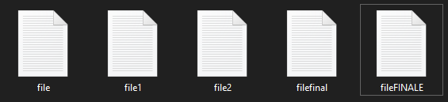

```{r setup, include=FALSE}
library(emo)
library(icons)
options(htmltools.dir.version = FALSE, knitr.duplicate.label = 'allow')
knitr::opts_chunk$set(fig.align = "center", eval = FALSE)
```

```{r, eval = FALSE, include = FALSE}
# This are the dependencies to compile this rmd.
remotes::install_github("mitchelloharawild/icons")
icons::download_fontawesome()
remotes::install_github("hadley/emo")
```


exclude: true

class: inverse, center, middle

# Introduction

---
exclude: true

# Utilisation de Git dans un travail avec R

**Résumé :** 

---

background-image: url(./CSU_RepRo_files/figure-html/phd101212s.png)
background-size: contain

# Pourquoi utiliser un CVS ?

???

Le travail de recherche est de nature incrémentielle et oblige l'accumulation de versions différentes. Cela devient vite compliqué de s'y retrouver.

---
exclude:true

# Pourquoi utiliser un CVS ?

Est-ce que vous avez déjà :

- **Fait un changement de code et voulu revenir en arrière ?**
- **Perdu du code ou une sauvegarde trop ancienne ?**
- Voulu voir la difference entre 2 versions ?
- Voulu vérifier l'historique d'un script ?
- **Voulu travailler sur un script a plusieurs ?**
- **Voulu partager votre code à quelqu'un ?**
- Voulu tester une nouveauté sans modifier du code déjà utile ?

Si oui, et dans plein de cas, un système de version control aurait pu vous simplifier la vie.

???

Diapo dite à l'orale avec le comic suivant.

---
# Pourquoi utiliser un CVS ?

```{r, engine='tikz', fig.ext = 'png', engine.opts = list(template = "tex/gitdags.tex"), echo = FALSE, eval=TRUE, cache=TRUE}

\begin{tikzpicture}
  \matrix (m)
    [
      matrix of nodes,
      nodes in empty cells,
      column sep      = 3em,
      row sep         = 5ex,
      column 1/.style = { nodes = { empty } },
      column 2/.style = { nodes = { empty } },
      column 3/.style = { nodes = { empty } },
      column 4/.style = { nodes = { empty } },
    ]
    {
        &  &  &  \\
        File.txt &  & File.txt & \com \\  % \textit{7f21c09}
        File1.txt &  & File.txt & \com \\ % \textit{d39ac60}
        File2.txt &  & File.txt & \com \\ % \textit{c78c64d}
        File\_final.txt &  & File.txt & \com \\ % \textit{cbdac1e}
    };
    \node[fit=(m-1-1)(m-1-1)]{Saving copies};
    \node[fit=(m-1-3)(m-1-4)]{Git workflow};
  \foreach \i/\j in {2/3,3/4,4/5} {
    \draw [arrow] (m-\i-4) -- (m-\j-4);
    \draw [arrow] (m-\i-3) -- (m-\i-4);
    \pic at (m-\i-2) {file};
  }
  \draw [arrow] (m-5-3) -- (m-5-4);
  \pic at (m-5-2) {file};
  
\end{tikzpicture}
```


???

Comparaison entre un historique "classique" et un historique avec git. Le nom de fichier n'est plus modifié et est donc plus facilement trouvable.

---
# Garder un historique avec Git

## Qu'est-ce qu'un commit ?

On a vu qu'il s'agit d'un snapshot, mais il contient plus de meta-données !

.pull-left[

- Liste des fichiers édités

- Différences de lignes édites

- Commit précédent (parent)
]

.pull-right[
- Auteur et email

- Date

- Message
]

???

Git enregistre que les lignes différentes donc c'est utile pour versionner des fichiers un peu brutes, de types code,c csv ou ou svg. Les images changent à chaque fois (comme les pdfs !)

Commit précédent -> notion d'arbre et d'historique !

--

Et un HASH (ou SHA) (identifiant unique) 

**<u>a64bc14</u>da18e47629e62b8e54d33d429c4b824e0**

La partie soulignée suffit le plus souvent.

---
# Garder un historique avec Git

## Anatomie d'un commit : git log

On peut retrouver le log de tout l'historique comme cela dans la console.

```{bash}
$ git log
```

Example :

```{bash}
commit f36044df028b44352c293bafb0d6016b666c09c0
Author: Maxime <gowachin@gmail.com>
Date:   Sun Nov 21 22:30:43 2021 +0100

    Time of deco stop near MN90 values

    Values are very close to MN90 tables, error should be due to different
    number and half life of compartments.
    Require to think how to set this in nice function so we can use them to
    plan dives but also represent saturations in later graphs !


```

---
# Garder un historique avec Git

```{r, out.width="85%", echo = FALSE, eval=TRUE}
knitr::include_graphics("CSU_RepRo_files/figure-html/commit_mess.png")
```

.footnote[
xkcd comics, [CC BY-NC 2.5 license](https://xkcd.com/license.html)
]

???

De l'utilité de mettre un commentaire qui fait sens.

---
exclude:true
# Garder un historique avec Git

## Git aide à comprendre l'historique.

Principe de **snapshot**, nommés **commit** dans git.

```{r, out.width="100%", echo = FALSE, eval=TRUE}

```

```{r, engine='tikz', fig.ext = 'png', engine.opts = list(template = "tex/gitdags.tex"), echo = FALSE, eval=TRUE, cache = TRUE}

\begin{tikzpicture}
\gitDAG[grow right sep = 2em]{
  file -- file1 -- { 
    file2,
    filefinal -- fileFINAL,
  }
};
\end{tikzpicture}
```

---
# Slide technique

Ces slides présentent l'utilisation de Git avec Rstudio, Github Desktop, R et bien sur Git Bash qui est un terminal de commande.

Bien que tout ces outils permettent de faire des dépots Git et de commit, plus on va avancer, plus il deviendra pertinent d'utiliser le terminal.

Il est donc préférable de lire cette partie de [Happy git for Ruser](https://happygitwithr.com/shell.html) afin d'appréhender cet outils qui offre toute la puissance de git.

Afin de ne pas paniquer, une [cheatsheet](https://services.github.com/on-demand/downloads/github-git-cheat-sheet.pdf) est également disponible ici pour comprendre la plupart des options.


---

class: inverse, center, middle

# Exercice : un fichier local

---
# Config git account !

Dans le terminal de commande Git Bash :

```{bash}
$ git config --global user.name 'Maxime Jaunatre'
$ git config --global user.email 'gowachin@gmail.com'
$ git config --global --list
```

Cela remplace votre nom et mail associé à votre compte github.

On peut aussi utiliser le package usethis dans la console R :

```{r}
## install if needed (do this exactly once):
## install.packages("usethis")
library(usethis)
use_git_config(user.name = "Maxime Jaunatre", 
               user.email = "gowachin@gmail.com")
```

---
# Initier git

## Créer un nouveau dossier (projet Rstudio)

Avec le terminal de commande Git Bash :

```{bash}
$ cd 
$ git init tuto_git
Initialized empty Git repository in path/to/your/directory/tuto/.git/

```

Avec Github Desktop (GHD) : File > New Repository > Type name > Create repository

Avec Rstudio : File > New Directory > R project > Type name + cocher "Create git repository"

---
# Initier git

## On peut aussi ajouter git à un projet existant

Avec le terminal de commande Git Bash :

```{bash}
$ cd path/to/directory
$ git init
Initialized empty Git repository in path/to/your/directory/tuto/.git/
```

Avec une commande R : 

```{r}
usethis::use_git()
# Lire ce qui se dit dans la console.
```

Avec Github Desktop (GHD) : File > New Repository > Type name > Create repository

Avec Rstudio : Tools > Project Options … > Git/SVN. Under “Version control system”, choisir “Git”. Confirm New Git Repository? Oui!


???

Globalement la même chose mais à partir d'un dossier existant.


---
# Créer un fichier et l'ajouter à Git

On va créer un fichier (.Rmd). Je propose que ce soit votre fichier de notes pour la session. 

On va le nommer `Notes_Maxime.Rmd`. Je vous laisse noter quelques mots dedans histoire d'avoir un fichier remplis.

Une fois le fichier sauvegardé (Ctrl+S), **git** va observer la modification !

Vérifier cela dans l'onglet Git ou alors dans le terminal de commande :

```{bash}
$ git status
```

On peut aussi voir ça dans l'onglet Git qui indique une petit *A* à côté de notre fichier.

???

On peut régler Rstudio pour qu'il montre le terminal git bash ! Et ça c'est pratique


---
# Premier commit

On peut faire notre premier commit !!!
Cela se passe en 2 étapes : ajouter les fichiers à l'index et faire le commit.

.pull-left[

**Git Bash**

```{bash}
$ git add Notes_Maxime.Rmd
$ git commit
```

Cela va ouvrir un éditeur de texte ! (Vim par défaut). On peut écrire ce qu'on veut ici.
]

.pull-right[

**R**

```{r}
usethis::use_git(
  message = "Initial commit"
  )
```

Ne permet pas d'être très précis.
]

.pull-left[
**GHD**

* Cliquer sur Changes

* Cocher la case à gauche

* Ecrire le commit
]

.pull-right[
**Rstudio**

* Cliquer sur Commit

* Cocher la case *Staged*

* Ecrire le commit
]


???

Tab permet l'auto completion des noms de fichiers !

---
# Répéter l'opération

On peut maintenant modifier le fichier et recommencer :

**Editer -> Sauvegarder -> Ajouter à l'index -> Commit**

--

On peut vérifier l'état avec *Diff* et l'historique avec *log*

.pull-left[

**Git Bash**

```{bash}
$ git status
$ git diff
$ git log
```
]

.pull-right[

**R**

Pour une fois que R ne fait pas tout...
]

.pull-left[
**GHD**

* Status -> Changes

* log -> History
]

.pull-right[
**Rstudio**

* Status -> Diff

* log -> icone Horloge
]

On va faire quelques commits... Ajoutez des fichiers pour tester !

---

class: inverse, center, middle

# Exercice : plusieurs fichiers locaux


---
# Multiples fichiers !

## Git peut inclure plusieurs fichiers dans un commit.

A vous de tester les différents cas suivants :

.pull-left[

* Ajouter des fichiers

* Supprimer un fichier
]

.pull-right[

* Renommer un fichier

* Déplacer un fichier dans un dossier
]

--

## Cas spécial : ignore un fichier

Il est parfois important de ne pas suivre un fichier avec Git. Pour cela on utilise le **.gitignore**

.pull-left[
**Git Bash**
```{bash}
$ vim .gitignore
```
]

.pull-right[
**Rstudio**

* Nouveau fichier txt nommé
]

```{bash}
./*.csv
./*.Rproj
./*.html
```


---

```{r child='github.Rmd', eval=TRUE}
```


---
exclude: false

# Ressources Git

.pull-left[

- [Tutoriel ThinkR : R and Git](https://thinkr.fr/travailler-avec-git-via-rstudio-et-versionner-son-code/)

- [Advance R &#x1F4D4;, H. Wickham](http://r-pkgs.had.co.nz/git.html)

- [Happy Git and GitHub for the useR](http://happygitwithr.com/)

- [Git cheatsheet](https://services.github.com/on-demand/downloads/github-git-cheat-sheet.pdf)

- [Quand ça part en vrille](https://github.com/k88hudson/git-flight-rules)

- [Réparer une erreur](http://ohshitgit.com/)

- [Créer une nouvelle branche avec git et merge des branches](https://github.com/Kunena/Kunena-Forum/wiki/Create-a-new-branch-with-git-and-manage-branches)
]

.pull-right[
```{r, out.width="90%", eval = TRUE, echo = FALSE}
knitr::include_graphics("Tuto_git_files/figure-html/git.png")
```
]

.footnote[
xkcd comics, [CC BY-NC 2.5 license](https://xkcd.com/license.html)
]

???

Beaucoup d'information est disponible.
Encore une fois, il vaut mieux commencer sur un petit projet où l'on est à l'aise.

---
class: inverse, center, middle

# Merci! Des questions &#x2753;

Slides en ligne [https://gowachin.github.io/R_presentation/Tuto_git.html](https://gowachin.github.io/R_presentation/Tuto_git.html)

[Fichiers source `r icons::fontawesome("r-project")`](https://github.com/gowachin/R_presentation) <!-- &nbsp;&nbsp;|&nbsp;&nbsp; [Fichier pdf `r icons::fontawesome("file-pdf")`](https://github.com/gowachin/R_presentation/raw/main/Tuto_git.pdf) -->

`r icons::fontawesome("github")` [gowachin](https://github.com/gowachin) &nbsp;&nbsp;&nbsp;&nbsp; `r icons::fontawesome("stack-overflow")` [gowachin](https://stackoverflow.com/users/12501379/gowachin)

.footnote[
Slides created via the R package [**xaringan**](https://github.com/yihui/xaringan).
]
