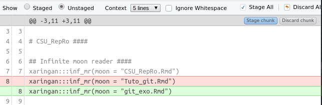

```{r setup, include=FALSE}
library(knitr)
library(emo)
library(icons)
options(htmltools.dir.version = FALSE, knitr.duplicate.label = 'allow')
knitr::opts_chunk$set(fig.align = "center", eval = FALSE)
```

```{r, eval = FALSE, include = FALSE}
# This are the dependencies to compile this rmd.
remotes::install_github("mitchelloharawild/icons")
icons::download_fontawesome()
remotes::install_github("hadley/emo")
```


exclude: true

class: inverse, center, middle

# Introduction

---
class: inverse, center, middle

# Practice

<!-- Ces slides présentent l'utilisation de Git avec Rstudio, Github Desktop, R et bien sur Git Bash qui est un terminal de commande. -->

<!-- Bien que tout ces outils permettent de faire des dépots Git et de commit, plus on va avancer, plus il deviendra pertinent d'utiliser le terminal. -->

<!-- Il est donc préférable de lire cette partie de [Happy git for Ruser](https://happygitwithr.com/shell.html) afin d'appréhender cet outils qui offre toute la puissance de git. -->

<!-- Afin de ne pas paniquer, une [cheatsheet](https://services.github.com/on-demand/downloads/github-git-cheat-sheet.pdf) est également disponible ici pour comprendre la plupart des options. -->


---
# Config git account !

In Git Bash terminal :

```{bash}
$ git config --global user.name 'Maxime Jaunatre'
$ git config --global user.email 'myveryownmail@mail.com'
$ git config --global --list
```

Or using the `{usethis}` package in R terminal :

```{r}
## install if needed (do this exactly once):
## install.packages("usethis")
library(usethis)
use_git_config(user.name = "Maxime Jaunatre",
               user.email = "myveryownmail@mail.com")
```

This allow to sign the commits

---
# Initiate git

## Create a new folder (Rstudio project)

In Git Bash terminal :

```{bash}
$ cd
$ git init tuto_git
Initialized empty Git repository in path/to/your/directory/tuto/.git/
```

<!-- Avec Github Desktop (GHD) : File > New Repository > Type name > Create repository -->

With Rstudio : File > New Directory > R project > Type name + check "Create git repository"

---
# Initiate git

## You can also add git to an existing project

In Git Bash terminal :

```{bash}
$ cd path/to/directory
$ git init
Initialized empty Git repository in path/to/your/directory/tuto/.git/
```

In R terminal :

```{r}
usethis::use_git()
# Read the messages !
```

<!-- Avec Github Desktop (GHD) : File > New Repository > Type name > Create repository -->

With Rstudio : Tools > Project Options … > Git/SVN. Under “Version control system”, choose “Git”. Confirm New Git Repository? Yes!


???

Basically the same thing but from an existing directory.


---
# Adding files to git repository

Once the file is saved (Ctrl+S), **git** will observe the change!

Check this in the Git tab or in the command terminal:

```{bash}
$ git status
```

We can also see that in the Git tab which indicates a small *A* next to our file.

???

We can set Rstudio to show the git bash terminal! And that's handy


---
# First commit

We can make our first commit!!!
It happens in 2 steps: add the files to the index and make the commit.

.pull-left[

**Git Bash**

```{bash}
$ git add Notes_Maxime.Rmd
$ git commit
```

This will open a text editor! (We can write whatever we want here.
]

.pull-right[

**Rstudio**

* Click on Commit

* Check the *Staged* box

* Write the commit
]

.pull-left[

**R**
```{r}
usethis::use_git(
  message = "Initial commit"
  )
# or
git2r::add(repo, "test.txt")
git2::commit(repo, "Commit message")
```
]

.pull-right[
```{r, out.width="85%", echo = FALSE, eval=TRUE}

```
]


???

Tab allows auto completion of file names !

---
# Repeat the operation

Now we can modify the file and start again:

**Edit -> Save -> Add to index -> Commit**

--

You can check the status with *Diff* and the history with *log*.

.pull-left[

**Git Bash**

```{bash}
$ git status
$ git diff
$ git log
```
]

.pull-right[
**Rstudio**

* Status -> Diff

* log -> Clock icon
]

.pull-left[

**R**
```{r}
git2r::status()
```
]

.pull-right[
```{r, out.width="85%", echo = FALSE, eval=TRUE}

```
]

Let's make some commits... Add some files to test!


---

class: inverse, center, middle

# Clone remote repository from github/gitlab

---
# Config Github Token (PAT) !

Github does not work anymore with passwords -> security !

Create a token by going to [https://github.com/settings/tokens](https://github.com/settings/tokens) and -> "Generate token".

Or in R :

```{r, echo = TRUE}
usethis::create_github_token()
```


Validate the boxes "repo", "user" and "workflow". Don't forget to copy the key !
It will be requested the next time you use git and need it.

You can even store it with R :

```{r, echo = TRUE}
gitcreds::gitcreds_set() # interactive command
```


---

# Clone a github repository

We will copy a remote repository to disk: **https://github.com/Ifremer-IAM/Tutorat_git**


.pull-left[

**Git Bash**

```{bash, echo = TRUE}
$ git clone <URL>
```
]

.pull-right[

**R**

For once R doesn't do everything...
]

.pull-left[
**Rstudio**

* File -> New Project

* Version Control -> Git

* URL : copy the url
]

.pull-right[
```{r, out.width="85%", echo = FALSE, eval=TRUE}

```
]

--

[Happy Git for the useR](https://happygitwithr.com/usage-intro.html) explains other cases than this one.

???

Take the time for everyone to pull and commit, because there will be conflicts!

---

# Commit -> Pull -> Push
```{r diag, engine='tikz', fig.ext = 'png', engine.opts = list(template = "tex/gitdags.tex"), echo = FALSE, eval=TRUE, cache = TRUE}
\begin{tikzpicture}[block/.style={draw,fill=strange,minimum height=2.5em},
                    font=\sffamily,>=stealth]

\begin{scope}[start chain=A going below,node distance=1em,
              local bounding box=buffers]
\node[block,minimum width=6em](remote){Remote github};
\node[right= 8em of remote, block,minimum width=6em](local){Fichiers};
\end{scope}

\node[below= 6em of buffers,align=center, block,minimum width=6em](repo){Repository \\Git local};

%\draw[->, thick](remote) edge[bend left] node[midway, fill=white]{Pull} (local);
\draw[->, thick](remote) edge[bend left] node[midway, fill=white]{Pull} (repo);
%\draw[->, thick](remote) edge[dashed] node[midway, fill=white]{Fetch} (repo);
\draw[->, thick](remote) edge node[midway, fill=white]{Clone} (local);
\draw[->,thick](local) edge[bend left] node[midway, fill=white]{Add} (repo);
\draw[->,thick](repo) edge[bend left] node[midway, fill=white]{Push} (remote);
\draw[->,thick](repo) edge[loop right] node[midway, fill=white]{Commit} (repo);


\end{tikzpicture}
```


---
# Create a new branch

.pull-left[

**Git Bash**

```{bash}
$ git checkout -b <NOM>
```
]

.pull-right[

**R**
```{r}
git2r::branch_create(name = <NOM>)
```
]


.pull-left[
**Rstudio**

* Onglet Git -> Symbole violet
]

.pull-right[
```{r, out.width="85%", echo = FALSE, eval=TRUE}

```
]

---
# Navigate in the history

Once a certain number of commits have been defined, you can go back or change branches.

## Change branch

.pull-left[

**Git Bash**

You just have to give the name of the branch. We can list them as follows:

```{bash}
$ git branch
```

Switch to the *main* branch

```{bash}
$ git checkout main
```
]

.pull-right[
**Rstudio**

* Git tab -> Next to the creation of branches you can choose which one to look at
]

You can change branches if all files are **committed** or ignored.


---
# Navigate in the history

Once a certain number of commits are defined, you can go back or change branches.

## Change commit

.pull-left[
**Git Bash**

You just have to give the SHA of the commit. We can list them as follows:

```{bash}
$ git log --oneline
$ git checkout <SHA>
```
]

.pull-right[
**Rstudio**

I haven't done this with Rstudio yet, if anyone finds it...

```{r}
# git2r::checkout()
```

]

You can change commits if all files are **commit** or ignored.

Another way to observe the past is to use **Github** which allows to easily visualize the history of a repository : see the article of [Happy Git for Ruser](https://happygitwithr.com/time-travel-see-past.html).

---
# Explanation

**git checkout** allows to move **HEAD**, which corresponds to what is presented on your computer.

.pull-left[
```{r head_act, engine='tikz', fig.ext = 'png', fig.width = 2, engine.opts = list(template = "tex/gitdags.tex"), echo = FALSE, eval=TRUE, cache = TRUE}
\begin{tikzpicture}
\gitDAG[grow right sep = 2em]{
    A -- B -- {
        C,
        {D -- E },
    }
};
% Branch
\gitbranch
{dev}      % node name and text
{above=of E} % node placement
{E}          % target
\gitbranch
{main}      % node name and text
{above=of C} % node placement
{C}          % target
% HEAD reference
\gitHEAD
{above= of B} % node placement
{B}          % target
% \SAandWT
\node[below= of A](git){\small \$ git checkout B};
\end{tikzpicture}
```
]

.pull-right[
```{r head_branch, engine='tikz', fig.ext = 'png', engine.opts = list(template = "tex/gitdags.tex"), echo = FALSE, eval=TRUE, cache = TRUE}

\begin{tikzpicture}
\gitDAG[grow right sep = 2em]{
    A -- B -- {
        C,
        {D -- E },
    }
};
% Branch
\gitbranch
{dev}      % node name and text
{above=of E} % node placement
{E}          % target
\gitbranch
{main}      % node name and text
{above=of C} % node placement
{C}          % target
% HEAD reference
\gitHEAD
{above=of dev} % node placement
{dev}          % target
% \SAandWT
\node[below= of A](git){\small \$ git checkout dev};
\end{tikzpicture}
```
]

--

.pull-left[
Reverting allows to see the state but you can also start a new branch re-commit from a past commit.
Example:

```{bash}
$ git checkout -b test A
$ git add ... ; git commit -m 'F'
```

]

.pull-right[
```{r head_past, engine='tikz', fig.ext = 'png', engine.opts = list(template = "tex/gitdags.tex"), echo = FALSE, eval=TRUE, cache = TRUE}
\begin{tikzpicture}
\gitDAG[grow right sep = 2em]{
    A -- {B -- {
        C,
        {D -- E },
    },
        F
    }
};
% Branch
\gitbranch
{dev}      % node name and text
{right=of E} % node placement
{E}          % target
\gitbranch
{main}      % node name and text
{right=of C} % node placement
{C}          % target
\gitbranch
{test}      % node name and text
{right=of F} % node placement
{F}          % target
% HEAD reference
\gitHEAD
{above=of F} % node placement
{F}          % target
% \SAandWT
\end{tikzpicture}
```
]

---
# Merging branches

Once the code is working we can do a **merge** of the branches.

.pull-left[
```{r branch_pre, engine='tikz', fig.ext = 'png', engine.opts = list(template = "tex/gitdags.tex"), echo = FALSE, eval=TRUE, cache = TRUE}
\begin{tikzpicture}
\gitDAG[grow right sep = 2em]{
    A -- B -- {
        C,
        {D -- E },
    }
};
% Branch
\gitbranch
{dev}        % node name and text
{right=of E} % node placement
{E}          % target
\gitbranch
{main}        % node name and text
{right=of C} % node placement
{C}          % target
% HEAD reference
\gitHEAD
{below=of E} % node placement
{E}          % target
% \SAandWT
\end{tikzpicture}
```
]

.pull-right[
```{r branch_premerge, engine='tikz', fig.ext = 'png', engine.opts = list(template = "tex/gitdags.tex"), echo = FALSE, eval=TRUE, cache = TRUE}
\begin{tikzpicture}
\gitDAG[grow right sep = 2em]{
    A -- B -- {
        C,
        {D -- E },
    }
};
% Branch
\gitbranch
{dev}        % node name and text
{right=of E} % node placement
{E}          % target
\gitbranch
{main}        % node name and text
{right=of C} % node placement
{C}          % target
% HEAD reference
\gitHEAD
{right=of main} % node placement
{main}          % target
% \SAandWT
\end{tikzpicture}
```
]

.pull-left[
A merge is always done from the target branch (*main*) by incorporating the external branch (here *dev*)

```{bash}
$ git checkout main
$ git merge dev
```
]

.pull-right[
```{r branch merge, engine='tikz', fig.ext = 'png', engine.opts = list(template = "tex/gitdags.tex"), echo = FALSE, eval=TRUE, cache = TRUE}
\begin{tikzpicture}
\gitDAG[grow right sep = 2em]{
    A -- B -- {
        C,
        {D -- E },
    } -- Merge
};
% Branch
\gitbranch
{main}        % node name and text
{right=of Merge} % node placement
{Merge}          % target
\gitbranch
{dev}        % node name and text
{below=of main} % node placement
{Merge}          % target
% HEAD reference
\gitHEAD
{above=of Merge} % node placement
{Merge}          % target
% \SAandWT
\end{tikzpicture}
```
]

In the case where each branch has commits, a new commit *merge* will be created with the opportunity to resolve conflicts. This commit belongs to both branches *main* and *dev*.

